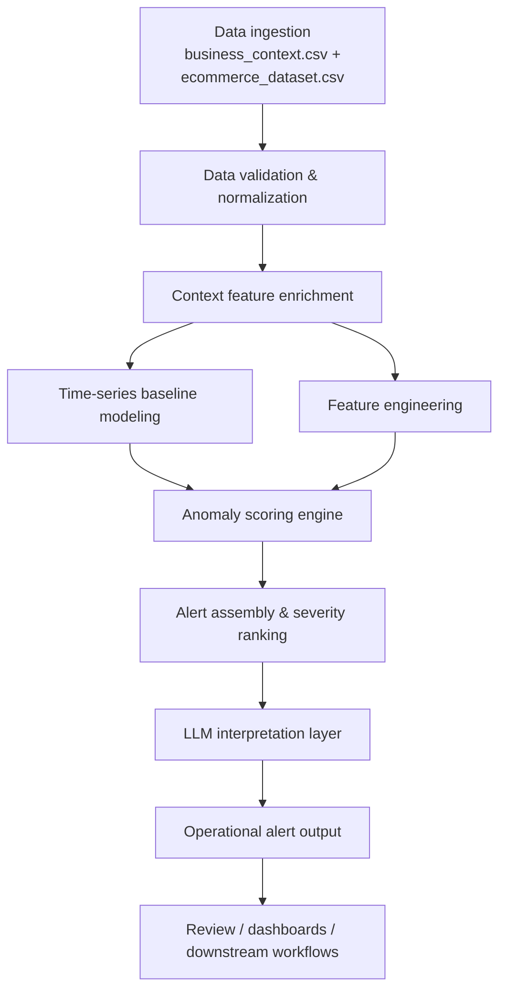

# Architecture Specification: Anomaly Detection Engine with LLM Interpretation Layer

## 1. Overview

This document specifies the design of a daily anomaly detection engine for e-commerce performance monitoring. The system consumes two datasets from the `data/` directory:

- `business_context.csv`: contextual signals such as holidays, release days, campaigns, and expected revenue multipliers.
- `ecommerce_dataset.csv`: daily operational metrics such as revenue, orders, churn, support tickets, and AI feature usage.

The goal is to detect statistically and operationally significant deviations from expected business behavior, and then provide a human-readable explanation through an LLM-based interpretation layer.

The project is designed around the observed behavior in the included data, which contains clearly abnormal periods such as:

- a sharp revenue collapse on `2025-11-05`
- a Black Friday spike on `2025-11-28` that is expected when `business_context.csv` is loaded and therefore should not be flagged as an anomaly in the context-aware pipeline
- an unusual support-ticket spike around `2025-10-20` to `2025-10-22`
- elevated churn in late October / early November
- anomalously high AI feature usage in December 2025

The pipeline is required to process the full seasonal window from `2025-10-01` through `2025-12-31` (92 days), not only October dates.
These patterns should be captured by a detection engine that is contextual, explainable, and operationally actionable.

---

## 2. Business Problem

The business needs a monitoring layer that can identify abnormal changes in e-commerce operations before they become material losses or customer experience issues. The solution must:

1. Detect anomalies in business performance across multiple metrics.
2. Incorporate known business context (campaigns, holidays, product launches).
3. Distinguish between expected seasonal behavior and true operational issues.
4. Prioritize alerts by severity and confidence.
5. Produce explanations understandable by operators and business stakeholders.

The engine is intended for daily operational monitoring, not high-frequency event streaming.

---

## 3. Data Sources and Schema

### 3.1 `business_context.csv`

Columns:

- `date`: ISO date
- `is_holiday`: binary indicator
- `holiday_name`: holiday label, empty for normal days
- `is_release_day`: binary indicator for product release or launch
- `marketing_campaign`: campaign label, empty for no active campaign
- `expected_revenue_multiplier`: expected revenue adjustment factor relative to the baseline

Examples:

- `2025-10-31` is a holiday (`Halloween`) with multiplier `1.1`
- `2025-11-01` onward contains a marketing campaign (`November Sale`) with multiplier `1.2`

### 3.2 `ecommerce_dataset.csv`

Columns:

- `date`: ISO date
- `revenue_usd`: daily revenue
- `orders_count`: number of placed orders
- `avg_order_value_usd`: average order value
- `customer_churn_rate`: daily churn rate
- `support_tickets`: daily support workload
- `ai_feature_usage_rate`: adoption/usage rate of AI-enabled features

This dataset is the primary signal source for anomaly detection.

---

## 4. Functional Requirements

### 4.1 Core detection requirements

The engine shall:

- ingest daily business context and operational metrics
- compute expected behavior based on historic patterns and known context
- score each date for multiple anomaly types
- detect both single-metric and multi-metric anomalies
- generate severity and confidence labels
- attach a human-readable explanation generated from structured anomaly data

### 4.2 Supported anomaly types

The engine must detect at least the following anomalies:

1. Revenue shortfall
   - revenue drops materially below expected baseline
2. Revenue surge
   - revenue exceeds expected range due to campaign, seasonal effect, or operational outlier
3. Orders collapse
   - sudden drop in order count with not enough compensation in order value
4. Support spike
   - support tickets rise above expected workload threshold
5. Churn deterioration
   - customer churn rate exceeds normal levels for the date range
6. AI adoption anomaly
   - AI feature usage deviates from the expected trend
7. Multi-signal coordinated anomaly
   - a combination of revenue, churn, and support tickets indicates a deeper issue

### 4.3 Output requirements

The engine must be context-aware by default. In particular:

- if `business_context.csv` is loaded, the Black Friday period (`2025-11-28`, Black Friday Week) should be treated as expected promotional behavior and should not be emitted as a revenue anomaly
- if the same date is evaluated without context, the revenue surge should be detectable as an outlier and the test should capture the difference between the context-aware and no-context behaviors
- missing or incomplete business context should trigger a deliberate fail-fast validation path rather than silently defaulting to incorrect model assumptions

For each detected anomaly, the system must emit a record with:

- `date`
- `anomaly_type`
- `severity` (`low`, `medium`, `high`, `critical`)
- `confidence` (0.0 to 1.0)
- `score`
- `expected_value`
- `actual_value`
- `delta`
- `context` (e.g. holiday, campaign, release day)
- `root_cause_hypotheses`
- `llm_summary`
- `related_metrics`
- `is_expected` (`true` or `false`)

---

## 5. Non-Functional Requirements

### 5.1 Reliability

- The system must be robust to missing values, sparse context records, and partial data outages.
- If the required business context file is missing or structurally invalid, the pipeline should fail fast and surface a clear validation error instead of silently defaulting to a wrong baseline.
- The system must also process the full seasonal date range from `2025-10-01` through `2025-12-31`, not stop after October.
- Critical operational alerts must not be silently dropped when external integrations are unavailable.

### 5.2 Explainability

- Every alert must include a structured evidence payload that can be consumed by product or operations teams.
- The LLM layer must not be the only source of truth; it should explain results derived from statistical models.

### 5.3 Performance

- Daily batch processing should complete within a few minutes for a dataset spanning multiple months.
- Online extensions should support streaming updates with low-latency re-scoring.

### 5.4 Security and compliance

- No secrets or customer-identifying data should be embedded in prompts.
- Outputs must be auditable with a clear breakdown of statistical evidence and generated explanations.

---

## 6. System Architecture

### 6.1 Ingestion layer

Responsible for:

- reading CSV files from `data/`
- validating column names and data types
- converting date strings to timestamps
- normalizing nulls and missing values
- joining business context with operational metrics by `date`

### 6.2 Context enrichment layer

Adds features derived from business context:

- `is_holiday`
- `holiday_name`
- `is_release_day`
- `marketing_campaign`
- `expected_revenue_multiplier`
- derived features such as campaign-active flag, holiday-adjusted expected baseline, and release-window indicators

### 6.3 Baseline modeling layer

The engine shall estimate expected values using a simple, auditable, business-appropriate approach based on rolling historical context and a context-aware adjustment. This project intentionally uses a lightweight methodology to keep the system explainable and operationally maintainable.

Required baseline method:

- rolling median over the previous 7- and 30-day windows
- context-adjusted expected value using holiday, campaign, and release-day flags
- robust z-score against the rolling median and MAD

The baseline should be calculated per metric:

- `revenue_usd`
- `orders_count`
- `avg_order_value_usd`
- `customer_churn_rate`
- `support_tickets`
- `ai_feature_usage_rate`

The use of higher-complexity forecasting or unsupervised outlier models is explicitly out of scope for this phase.

### 6.4 Anomaly scoring engine

The engine shall produce a score per metric and a composite score per date using a simplified, transparent model that is suitable for daily review.

Required scoring components:

- rolling median baseline
- median absolute deviation (MAD)
- robust z-score relative to the rolling baseline
- context-adjusted residual against expected business periods
- local neighborhood comparison (previous 7- and 30-day windows)

Composite anomaly score:

$$
score_{date} = w_1 z_{revenue} + w_2 z_{orders} + w_3 z_{churn} + w_4 z_{support} + w_5 z_{ai\_usage}
$$

where each $z$ value is based on the rolling median and MAD, and the weights are tuned conservatively to avoid overreacting to expected campaign or holiday effects.

### 6.5 Methodology-critical files and review gate

The following files contain business logic that materially affects detection thresholds, alert severity, and interpretation quality and therefore require mandatory human review before merge:

- `pipeline/src/baseline.py` — rolling baseline and expected-value logic
- `pipeline/src/scoring.py` — z-score, anomaly thresholds, and alert scoring
- `pipeline/src/alert_ranking.py` — severity and confidence aggregation
- `pipeline/src/llm_interpretation.py` — structured prompt construction and summary generation
- `pipeline/src/correlation_detector.py` — correlated anomaly detection logic for outage detection

These files are designated as `methodology_critical` and must not be merged without explicit sign-off by a reviewer familiar with the business context and alerting policy.

### 6.6 Correlated Anomaly Detection

The engine must detect a correlated outage anomaly, `revenue_support_correlation`, when both conditions are true on the same day:

- revenue drops below 40% of baseline
- support tickets exceed 3x baseline

Required behavior:

- anomaly type: `revenue_support_correlation`
- severity: always `critical`
- `is_expected`: always `false` regardless of context or business calendar
- this rule must override holiday, campaign, or release-day explanations
- the signal must be labeled as a likely technical outage or severe platform degradation in the explanation layer

This detection rule is intentionally strict because the combination of revenue collapse and support load spike represents a severe operational signal that should not be suppressed by business context.

### 6.7 Severity and confidence

Severity should be derived from both magnitude and business impact.

Example scoring logic:

- critical: score > 0.9 and metric breach exceeds a business threshold
- high: score 0.75 to 0.89 or multiple metrics fail concurrently
- medium: score 0.5 to 0.74
- low: score below 0.5 but still above detection threshold

Confidence should combine:

- historical consistency of the pattern
- number of signals contributing to the event
- context fit (e.g. the date is a holiday and the anomaly is consistent with the expected multiplier)
- model agreement across detectors

---

## 7. LLM Interpretation Layer

Each detected anomaly should be accompanied by a structured natural-language summary generated by the LLM layer. The model should not be used to decide whether an anomaly exists; it should explain the evidence already assembled by the statistical engine.

Required behavior:

- summarize what metric changed, by how much, and over what period
- call out whether the issue is expected or unexpected
- identify likely root causes or hypotheses
- keep explanations operationally grounded in the actual metrics and context
- do not fabricate policies or events not present in the dataset

The LLM layer is also responsible for making the output readable to non-technical stakeholders, supporting operational triage, and explaining why the anomaly might be a true outage or a seasonal effect.

---

## 8. Review and Acceptance Gates

### Gate 1: Architecture approval

The architecture spec must be reviewed and approved by a human before implementation begins.

### Gate 2: Implementation verification

The implementation must pass the automated test suite, including context-aware and no-context regression scenarios.

### Gate 3: Methodology review

The methodology-critical files must pass the rubric-based review for:

- silent failure risk
- business-context dependence
- test coverage gaps
- threshold ownership

A project cannot merge if a critical silent failure is detected or if alerting logic is silently downgraded.

---

## 9. Acceptance Criteria

The project is accepted when all of the following are true:

1. The pipeline processes the full daily date range from `2025-10-01` to `2025-12-31`.
2. Black Friday is not misclassified as an anomaly when `business_context.csv` is loaded.
3. `2025-11-05` is treated as a real anomaly or outage signal when context and severity rules indicate it.
4. Support and churn spikes in late October are surfaced correctly.
5. The output includes `is_expected` status and a clear explanation of the business context.
6. Methodology-critical files are reviewed and approved before merge.

This specification is the source of truth for the implementation and review process.
