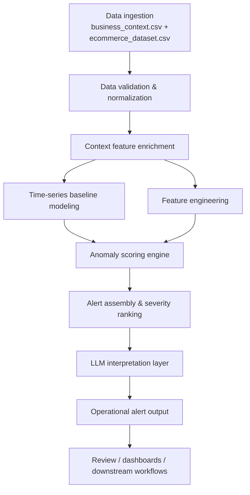

# Architecture Specification: Anomaly Detection Engine with LLM Interpretation Layer

## 1. Overview

This document specifies the design of a daily anomaly detection engine for e-commerce performance monitoring. The system consumes two datasets from the `data/` directory:

- `business_context.csv`: contextual signals such as holidays, release days, campaigns, and expected revenue multipliers.
- `ecommerce_dataset.csv`: daily operational metrics such as revenue, orders, churn, support tickets, and AI feature usage.

The goal is to detect statistically and operationally significant deviations from expected business behavior, and then provide a human-readable explanation through an LLM-based interpretation layer.

The project is designed around the observed behavior in the included data, which contains clearly abnormal periods such as:

- a sharp revenue collapse on `2025-11-05`
- a Black Friday spike on `2025-11-28` that is expected when `business_context.csv` is loaded and therefore should not be flagged as an anomaly in the context-aware pipeline
- an unusual support-ticket spike around `2025-10-20` to `2025-10-22`
- elevated churn in late October / early November
- anomalously high AI feature usage in December 2025

The pipeline is required to process the full seasonal window from `2025-10-01` through `2025-12-31` (92 days), not only October dates.
These patterns should be captured by a detection engine that is contextual, explainable, and operationally actionable.

---

## 2. Business Problem

The business needs a monitoring layer that can identify abnormal changes in e-commerce operations before they become material losses or customer experience issues. The solution must:

1. Detect anomalies in business performance across multiple metrics.
2. Incorporate known business context (campaigns, holidays, product launches).
3. Distinguish between expected seasonal behavior and true operational issues.
4. Prioritize alerts by severity and confidence.
5. Produce explanations understandable by operators and business stakeholders.

The engine is intended for daily operational monitoring, not high-frequency event streaming.

---

## 3. Data Sources and Schema

### 3.1 `business_context.csv`

Columns:

- `date`: ISO date
- `is_holiday`: binary indicator
- `holiday_name`: holiday label, empty for normal days
- `is_release_day`: binary indicator for product release or launch
- `marketing_campaign`: campaign label, empty for no active campaign
- `expected_revenue_multiplier`: expected revenue adjustment factor relative to the baseline

Examples:

- `2025-10-31` is a holiday (`Halloween`) with multiplier `1.1`
- `2025-11-01` onward contains a marketing campaign (`November Sale`) with multiplier `1.2`

### 3.2 `ecommerce_dataset.csv`

Columns:

- `date`: ISO date
- `revenue_usd`: daily revenue
- `orders_count`: number of placed orders
- `avg_order_value_usd`: average order value
- `customer_churn_rate`: daily churn rate
- `support_tickets`: daily support workload
- `ai_feature_usage_rate`: adoption/usage rate of AI-enabled features

This dataset is the primary signal source for anomaly detection.

---

## 4. Functional Requirements

### 4.1 Core detection requirements

The engine shall:

- ingest daily business context and operational metrics
- compute expected behavior based on historic patterns and known context
- score each date for multiple anomaly types
- detect both single-metric and multi-metric anomalies
- generate severity and confidence labels
- attach a human-readable explanation generated from structured anomaly data

### 4.2 Supported anomaly types

The engine must detect at least the following anomalies:

1. Revenue shortfall
   - revenue drops materially below expected baseline
2. Revenue surge
   - revenue exceeds expected range due to campaign, seasonal effect, or operational outlier
3. Orders collapse
   - sudden drop in order count with not enough compensation in order value
4. Support spike
   - support tickets rise above expected workload threshold
5. Churn deterioration
   - customer churn rate exceeds normal levels for the date range
6. AI adoption anomaly
   - AI feature usage deviates from the expected trend
7. Multi-signal coordinated anomaly
   - a combination of revenue, churn, and support tickets indicates a deeper issue

### 4.3 Output requirements

The engine must be context-aware by default. In particular:

- if `business_context.csv` is loaded, the Black Friday period (`2025-11-28`, Black Friday Week) should be treated as expected promotional behavior and should not be emitted as a revenue anomaly
- if the same date is evaluated without context, the revenue surge should be detectable as an outlier and the test should capture the difference between the context-aware and no-context behaviors
- missing or incomplete business context should trigger a deliberate fail-fast validation path rather than silently defaulting to incorrect model assumptions

For each detected anomaly, the system must emit a record with:

- `date`
- `anomaly_type`
- `severity` (`low`, `medium`, `high`, `critical`)
- `confidence` (0.0 to 1.0)
- `score`
- `expected_value`
- `actual_value`
- `delta`
- `context` (e.g. holiday, campaign, release day)
- `root_cause_hypotheses`
- `llm_summary`
- `related_metrics`
- `is_expected` (`true` or `false`)

---

## 5. Non-Functional Requirements

### 5.1 Reliability

- The system must be robust to missing values, sparse context records, and partial data outages.
- If the required business context file is missing or structurally invalid, the pipeline should fail fast and surface a clear validation error instead of silently defaulting to a wrong baseline.
- The system must also process the full seasonal date range from `2025-10-01` through `2025-12-31`, not stop after October.
- Critical operational alerts must not be silently dropped when external integrations are unavailable.

### 5.2 Explainability

- Every alert must include a structured evidence payload that can be consumed by product or operations teams.
- The LLM layer must not be the only source of truth; it should explain results derived from statistical models.

### 5.3 Performance

- Daily batch processing should complete within a few minutes for a dataset spanning multiple months.
- Online extensions should support streaming updates with low-latency re-scoring.

### 5.4 Security and compliance

- No secrets or customer-identifying data should be embedded in prompts.
- Outputs must be auditable with a clear breakdown of statistical evidence and generated explanations.

---

## 6. System Architecture

```mermaid
flowchart TD
    A[Data ingestion\n business_context.csv + ecommerce_dataset.csv] --> B[Data validation & normalization]
    B --> C[Context feature enrichment]
    C --> D[Time-series baseline modeling]
    C --> E[Feature engineering]
    D --> F[Anomaly scoring engine]
    E --> F
    F --> G[Alert assembly & severity ranking]
    G --> H[LLM interpretation layer]
    H --> I[Operational alert output]
    I --> J[Review / dashboards / downstream workflows]
```

### 6.1 Ingestion layer

Responsible for:

- reading CSV files from `data/`
- validating column names and data types
- converting date strings to timestamps
- normalizing nulls and missing values
- joining business context with operational metrics by `date`

### 6.2 Context enrichment layer

Adds features derived from business context:

- `is_holiday`
- `holiday_name`
- `is_release_day`
- `marketing_campaign`
- `expected_revenue_multiplier`
- derived features such as campaign-active flag, holiday-adjusted expected baseline, and release-window indicators

### 6.3 Baseline modeling layer

The engine shall estimate expected values using a simple, auditable, business-appropriate approach based on rolling historical context and a context-aware adjustment. This project intentionally uses a lightweight methodology to keep the system explainable and operationally maintainable.

Required baseline method:

- rolling median over the previous 7- and 30-day windows
- context-adjusted expected value using holiday, campaign, and release-day flags
- robust z-score against the rolling median and MAD

The baseline should be calculated per metric:

- `revenue_usd`
- `orders_count`
- `avg_order_value_usd`
- `customer_churn_rate`
- `support_tickets`
- `ai_feature_usage_rate`

The use of higher-complexity forecasting or unsupervised outlier models is explicitly out of scope for this phase.

### 6.4 Anomaly scoring engine

The engine shall produce a score per metric and a composite score per date using a simplified, transparent model that is suitable for daily review.

Required scoring components:

- rolling median baseline
- median absolute deviation (MAD)
- robust z-score relative to the rolling baseline
- context-adjusted residual against expected business periods
- local neighborhood comparison (previous 7- and 30-day windows)

Composite anomaly score:

$$
score_{date} = w_1 z_{revenue} + w_2 z_{orders} + w_3 z_{churn} + w_4 z_{support} + w_5 z_{ai\_usage}
$$

where each $z$ value is based on the rolling median and MAD, and the weights are tuned conservatively to avoid overreacting to expected campaign or holiday effects.

### 6.5 Methodology-critical files and review gate

The following files contain business logic that materially affects detection thresholds, alert severity, and interpretation quality and therefore require mandatory human review before merge:

- `pipeline/src/baseline.py` — rolling baseline and expected-value logic
- `pipeline/src/scoring.py` — z-score, anomaly thresholds, and alert scoring
- `pipeline/src/alert_ranking.py` — severity and confidence aggregation
- `pipeline/src/llm_interpretation.py` — structured prompt construction and summary generation

These files are designated as `methodology_critical` and must not be merged without explicit sign-off by a reviewer familiar with the business context and alerting policy.

### 6.6 Severity and confidence

Severity should be derived from both magnitude and business impact.

Example scoring logic:

- critical: score > 0.9 and metric breach exceeds a business threshold
- high: score 0.75 to 0.89 or multiple metrics fail concurrently
- medium: score 0.5 to 0.74
- low: score below 0.5 but still above detection threshold

Confidence should combine:

- historical consistency of the pattern
- number of signals contributing to the event
- context fit (e.g. the date is a holiday and the anomaly is consistent with the expected multiplier)
- model agreement across detectors

---

## 7. LLM Interpretation Layer

Each detected anomaly should be accompanied by a structured natural-language summary generated by the LLM layer. The model should not be used to decide whether an anomaly exists; it should explain the evidence already assembled by the statistical engine.

Required behavior:

- summarize what metric changed, by how much, and over what period
- call out whether the issue is expected or unexpected
- identify likely root causes or hypotheses
- keep explanations operationally grounded in the actual metrics and context
- do not fabricate policies or events not present in the dataset

The LLM layer is also responsible for making the output readable to non-technical stakeholders, supporting operational triage, and explaining why the anomaly might be a true outage or a seasonal effect.

---

## 8. Review and Acceptance Gates

### Gate 1: Architecture approval

The architecture spec must be reviewed and approved by a human before implementation begins.

### Gate 2: Implementation verification

The implementation must pass the automated test suite, including context-aware and no-context regression scenarios.

### Gate 3: Methodology review

The methodology-critical files must pass the rubric-based review for:

- silent failure risk
- business-context dependence
- test coverage gaps
- threshold ownership

A project cannot merge if a critical silent failure is detected or if alerting logic is silently downgraded.

---

## 9. Acceptance Criteria

The project is accepted when all of the following are true:

1. The pipeline processes the full daily date range from `2025-10-01` to `2025-12-31`.
2. Black Friday is not misclassified as an anomaly when `business_context.csv` is loaded.
3. `2025-11-05` is treated as a real anomaly or outage signal when context and severity rules indicate it.
4. Support and churn spikes in late October are surfaced correctly.
5. The output includes `is_expected` status and a clear explanation of the business context.
6. Methodology-critical files are reviewed and approved before merge.

This specification is the source of truth for the implementation and review process.

---

## 10. Correlated Outage Override (methodology_critical)

### 10.1 The rule

On any single date, if **both** of the following hold against that date's context-adjusted expected values:

- `revenue_usd` < **0.40 ×** `revenue_usd_expected`, and
- `support_tickets` > **3.0 ×** `support_tickets_expected`

then the emitted alert must be classified as:

- `anomaly_type`: `"outage"`
- `severity`: `"critical"`
- `is_expected`: `false`

These three values are **forced**, not suggested. They apply regardless of `is_holiday`, `holiday_name`, `marketing_campaign`, `is_release_day` or `expected_revenue_multiplier`, and regardless of the composite anomaly score and the severity `severity_for_score` would otherwise assign. Both conditions are strict inequalities and both must hold on the same date; either leg alone leaves classification to the normal path.

**Input source.** The rule reads the `actual` and `expected` fields of the `revenue_usd` and `support_tickets` entries in that date's anomaly list — the only per-metric values `build_alerts` receives. If either entry is absent, or either expected value is zero or negative, the rule does not fire and no division is performed. A metric only appears in that list if it crossed its z-score threshold in `pipeline/src/scoring.py`, which creates a real detection gap; §10.5 records it and the change needed to close it.

### 10.2 Why it overrides business context

Business context exists to suppress deviations that a known demand event explains (§4.3). Every such event — a holiday, a campaign, a release — moves revenue and support load in the *same* direction: more traffic means more sales *and* more tickets.

A day where revenue falls to under half of expectation while support load more than triples is the opposite shape. No promotion, holiday or launch predicts it. That divergence is the signature of a platform failure: customers are arriving, failing to transact, and contacting support about it. Reading such a day as "expected, there was a campaign running" inverts the meaning of the evidence.

This is precisely the silent-failure mode Gate 3 exists to catch (§8); §5.1 already requires that critical operational alerts never be silently dropped, and §9.3 requires that `2025-11-05` be treated as a real outage signal. Today that date is classified `critical` only because its composite score happens to reach 39.35 across three signals. The override makes the classification a guaranteed property of the rule rather than a side effect of the magnitude the score happens to reach.

### 10.3 Where it is implemented

In `pipeline/src/alert_ranking.py`, inside `build_alerts`, as the **final classification step for each record** — after `anomaly_type`, `severity`, `confidence` and `is_expected` have been computed, and after the "expected deviations are never escalated" downgrade. The override supersedes that downgrade. This ordering is part of the contract, not an implementation detail.

`pipeline/src/alert_ranking.py` is already designated `methodology_critical` in §6.5, so this rule inherits the mandatory Gate 3 sign-off. Human review is required because the rule hard-overrides the business-context layer: a wrong threshold here does not degrade an alert, it manufactures or suppresses a critical one, and no downstream stage can correct it.

**The override is additive.** The existing independent guards — revenue below 0.2× expected, or support above 5.0× expected, each of which alone forces `is_expected = false` — remain exactly as they are. They are not folded into this rule and their thresholds are not touched. In particular, lowering the 5.0× support guard to 3.0× to "match" this rule would flip `2025-11-28` to `is_expected = false` and break the Black Friday suppression required by §4.3.

**Fields that must not move.** Primary-metric selection (largest |z|) is unchanged, so `expected_value`, `actual_value` and `delta` continue to describe the same metric they describe today. `score`, `confidence`, `context` and `related_metrics` are unchanged. Only `anomaly_type`, `severity` and `is_expected` are written by this rule.

`llm_summary` and `root_cause_hypotheses` are derived from `anomaly_type` and will therefore change for an overridden date. That is expected. Note that `pipeline/src/llm_interpretation.py` has no `outage` branch in its fallback hypotheses, so an offline run produces the generic fallback text. Adding a dedicated `outage` branch is a deliberate follow-up, out of scope here.

### 10.4 Acceptance criteria

Running the pipeline on `data/`:

1. The alert list still contains **15 alerts, on the same 15 dates** as before the change.
2. `2025-11-05` changes in exactly one classification field: `anomaly_type` becomes `"outage"` (from `"support_spike"`). On that record `severity` remains `critical`, `is_expected` remains `false`, `score` remains `39.35`, `confidence` remains `0.99`, `expected_value` remains `16.0`, `actual_value` remains `132.0`, `delta` remains `116.0`, and `related_metrics` remains `["revenue_usd", "orders_count", "support_tickets"]`. Its `llm_summary` and `root_cause_hypotheses` re-render from the new type.
3. **No other alert changes in any field.** In particular `2025-11-28` remains `support_spike` / `medium` / `is_expected = true`, and the twelve `ai_usage_spike`, `support_spike` and `churn_deterioration` alerts in October, November and December are untouched.
4. `2025-11-05` is the only date in the `2025-10-01`–`2025-12-31` window that satisfies both legs of the rule. This is a property of the current dataset, not a guarantee of the rule.
5. The full existing test suite passes unmodified.

### 10.5 What tests cannot verify

The following require human judgment and must be resolved at Gate 1 and re-examined at Gate 3. A green test suite is not evidence on any of them.

**The revenue leg has a blind spot (accepted at Gate 1 — see §10.6).** The rule can only see metrics that reached the anomaly list, and `revenue_usd` must clear a z-score of 3.2 to get there. Revenue is volatile enough that a severe shortfall often does not. Setting `2025-11-05` aside, ten dates in the current window sit below 40% of expected revenue — `2025-11-25` through `2025-11-27`, `2025-11-29`, `2025-11-30`, `2025-12-20`, and `2025-12-26` through `2025-12-29` — with revenue z-scores ranging from +0.7 to −2.5, all well inside the ±3.2 threshold, so not one of them carries a `revenue_usd` entry. On `2025-11-30` revenue runs at 20.2% of expected and this rule cannot see it. Had support tickets tripled that day, no outage would have been classified.

**On the current data the blind spot costs nothing.** Support load is quiet on all ten of those dates: the highest support ratio among them is 1.18× expected (`2025-11-25`), so none comes near the 3.0× second leg and no outage is missed. Six of the ten fall below 40% only because context multipliers inflate their expected revenue — `2025-11-25` through `2025-11-30` under the Black Friday Week 3.0× multiplier, and `2025-12-20` under the Christmas Campaign 1.8× — and all six sit at or above 40% of an unmultiplied baseline, `2025-11-25` reaching 119%. Two of them, `2025-11-25` and `2025-11-26`, carry *positive* revenue z-scores while nominally 60% below expectation, which is that inflation showing through directly. The remaining four, `2025-12-26` through `2025-12-29`, are shortfalls not explained by the current context (likely post-holiday seasonality, not necessarily incidents) that stay below 40% even at a 1.0× multiplier; `2025-12-26` carries a deflating 0.5× multiplier and still runs at 24.6% of expected. A multiplier review therefore accounts for six of these dates but not for the other four.

Closing the gap means carrying `revenue_usd_expected` and `support_tickets_expected` on every candidate row out of `build_alert_candidates` in `pipeline/src/scoring.py`, so the rule tests the ratios directly instead of inheriting the z-score gate. Gate 1 has deferred that change pending a review of the context multipliers (§10.6).

**The thresholds have no owner.** 40% and 3× encode business risk appetite; they are not derived from the data. The qualifying date sits at 11.3% of expected revenue and 8.25× expected support, so every criterion in §10.4 passes identically for any revenue threshold between roughly 12% and 90% and any support threshold between roughly 1× and 8×. A passing suite confirms the rule fires on this date; it says nothing about whether these are the right numbers. A named owner for both must be recorded.

**Black Friday is closer to this rule than it looks.** `2025-11-28` already runs at 3.73× expected support tickets, satisfying the support leg outright. It is held back only by the revenue leg, at 69.7% of an expectation inflated by a 4.5× multiplier. Raise that multiplier, or have a Black Friday underperform by roughly another 30%, and the largest promotional day of the year is force-classified a critical outage that business context is explicitly forbidden to suppress. No test against the current dataset surfaces this. A human must decide whether the override should be bounded — for example disregarded when the shortfall is measured against a multiplier above some value — or whether a false critical during a campaign is an acceptable price for never missing a real outage.

**The rule inherits the baseline's accuracy.** Both legs are ratios against §6.3 expected values. Where those expectations are wrong, the override converts a quiet baseline error into a forced critical alert that nothing downstream can soften. Someone must confirm the expected-value model is trustworthy enough to carry that weight.

**The rule infers a cause from a shape.** A data pipeline failure, a botched migration, a mis-scaled multiplier and a genuine platform outage all produce the same two-metric signature. Tests can prove the classification fired; only a human can confirm the day was in fact an incident. The `"outage"` label reaches non-technical stakeholders as a factual claim.

**Forcing `critical` bypasses severity policy.** `severity_for_score` no longer has a say on these dates. Whether every correlated day is worth paging on-call is an alerting-policy decision, not a modelling one.

**The window is one day.** A degradation unfolding gradually across three days, or an incident straddling midnight with each half below threshold, is invisible to this rule. Nothing in the current suite would reveal that gap, and no failing test would ever point at it.

### 10.6 Gate 1 decision

Recorded 2026-09-27.

1. **Scope is confined to `pipeline/src/alert_ranking.py`.** `pipeline/src/scoring.py` must not be modified in this change. The revenue-leg blind spot described in §10.5 is accepted as a known limitation of this phase.
2. **Closing the blind spot is a separate change**, blocked on a review of the context multipliers in `data/business_context.csv`: six of the ten affected dates fall below the 40% threshold only because those multipliers inflate expected revenue, so the multipliers must be settled before the detection gap is re-scoped.
3. **Threshold ownership.** The 40% revenue and 3.0× support thresholds are owned by Galina Zirneeva (Data & AI), to be reviewed with ops after the pilot. The context multipliers in `data/business_context.csv` are owned by marketing.
4. **The 5.0× support guard is not to be changed.** It and the 0.2× revenue guard beside it stand as recorded in §10.3.
5. **Placement.** §10 remains appended after §9; sections 1 through 9 are not renumbered.
